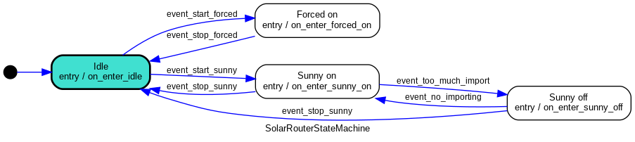

# soft solar router

pilot water heater power switch 
- during solar panel production 
- during grid discount hours when tomorrow is cloudy

## weather module
Get the solar irradiance for the next 2 days 

## power monitoring module

get the consumption of the home, the solar panel production, and the grid import

## settings module

hold the application settings

## water eater power switch module
- turn on
- turn off

-  the schedule (depends of weather interface): 
     - give  the sunny period of the next 3 days 
     - give the forced switch on power

## monitoring module
- push monitoring data to influxdb server

## application module

### events.py

from weather, power and settings modules, events.py contains methods to generates events

#### event_start_sunny/event_stop_sunny:
- is_sunny_now(weather: Weather, now: datetime, settings: Settings) -> bool
    decide if solar production should be enough: compare current solar irradiance with **settings.minimal_solar_irradiance_wm2**

#### event_start_forced/event_stop_forced :
- is_cloudy_tomorrow(now: datetime, weather: Weather, settings: Settings) -> bool
    decide if tomorrow will be cloudy. check that solar irradiance > **settings.minimal_solar_irradiance_wm2** during **settings.minimal_daily_solar_hours**
- is_forced_period_window(now: datetime, settings: Settings) -> bool
    define discount grid hours with **settings.forced_hour_begin** and **settings.forced_hour_duration**

#### event_too_much_import:
- is_too_much_import(now: datetime, power: Power, settings: Settings) -> bool
    return True when grid import > **settings.too_much_import_watts** during **settings.too_much_import_duration**

#### event_no_importing
- is_no_importing(now: datetime, power: Power, settings: Settings) -> bool:
    return True when grid import < **settings.no_import_watts** during **settings.no_import_duration** 

### state_machine.py

